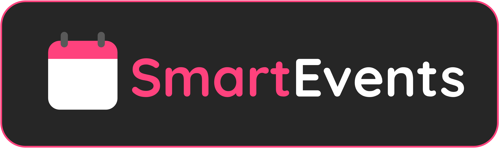

Aplicación web para eventos tecnológicos con countdown, listado de eventos y sistema de comentarios.

## ¿Qué hace?

- **Página principal**: Muestra cuenta regresiva del próximo evento
- **Eventos**: Lista de todos los eventos con información y registro
- **Comunidad**: Comentarios que se guardan en el navegador

## Cómo usarlo

1. Abrir `index.html` en un navegador
2. Para desarrollo: usar Live Server en VS Code
3. Navegar entre páginas con el menú

## Archivos principales

- `index.html` - Página principal con countdown
- `events.html` - Lista de eventos  
- `community.html` - Comentarios
- `js/main.js` - JavaScript principal
- `js/data/events.js` - Datos de eventos

## Tecnologías

- HTML5
- CSS (Bootstrap 5 tema oscuro)
- JavaScript modular
- localStorage para guardar comentarios

## Añadir eventos

Editar `js/data/events.js`:

```javascript
{
    id: 'mi-evento',
    title: 'Mi Evento',
    date: '2025-12-01T19:00:00',
    location: 'Mi Lugar',
    capacity: '100 personas',
    status: 'upcoming'
}
```
